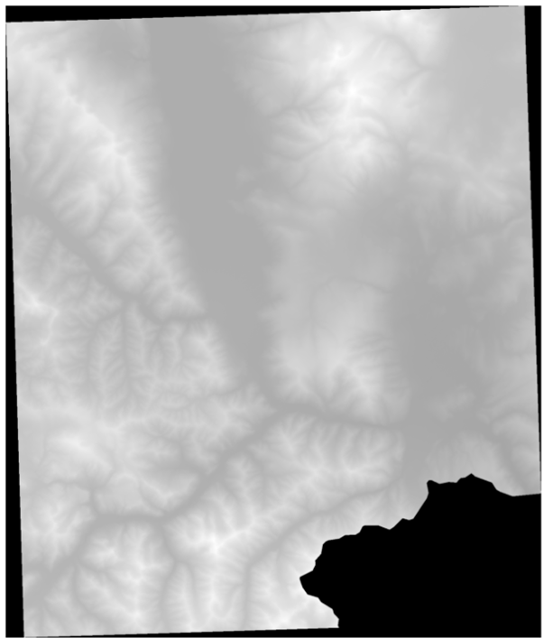
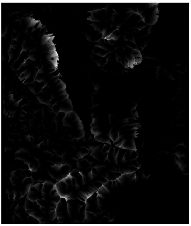

# Physics-Guided Glacier Mapping

This repository contains code for physics-guided clean ice (CI) and
debris-covered ice (DCI) segmentation from Landsat imagery.

The project adds physics-derived information to a standard U-Net pipeline. The
main experiments keep the segmentation architecture fixed and compare how static
terrain channels, dynamic velocity channels, and a velocity-aware loss affect
glacier mapping performance.

## Strategies

1. **Physics-Informed Data Augmentation** -- Encode DEM-derived
   terrain features (flow accumulation, TPI, roughness, plan curvature) and
   spectral indices (NDVI, NDWI, NDSI) as additional input channels to guide
   the model toward physically plausible ice boundaries.

2. **Physics-Informed Loss Functions** -- Penalize predictions that
   violate glacier flow physics using a sigmoid-based velocity loss: if the
   model predicts background on a pixel moving faster than surrounding static
   terrain, it is penalized.

3. **Dynamic Velocity Integration** -- Fuse ITS_LIVE velocity datacubes
   with Landsat imagery using geometric discovery, 7-year temporal aggregation,
   cross-UTM-zone reprojection, and bilinear resampling from 120 m to 30 m.

## Key Results on the HKH Glacier Dataset

| Model | DCI IoU | DCI Prec. | DCI Rec. | CI IoU | CI Prec. | CI Rec. |
|---|---|---|---|---|---|---|
| Standard U-Net | 28.50 | -- | -- | 65.60 | -- | -- |
| Boundary-Aware (SOTA, Aryal et al. 2023) | 35.94 | 51.97 | 53.81 | **68.17** | 81.59 | 80.55 |
| Ours (Flow Only) | 38.50 | 58.90 | 52.60 | 63.50 | 78.90 | 76.40 |
| Ours (Full Static Physics) | **45.92** | **71.89** | **55.96** | **71.22** | **85.39** | **81.10** |
| Ours (Velocity Channels Only) | 32.40 | 70.25 | 37.56 | 70.78 | 82.27 | 83.52 |
| Ours (Velocity Channels + Loss) | 41.91 | 66.40 | 53.20 | 61.83 | 64.90 | **92.90** |
| Ours (Complete Physics-Informed) | **46.07** | **71.95** | **56.16** | 65.85 | 72.36 | 87.98 |

- **Full Static Physics** (DEM flow accumulation + TPI + roughness + plan
  curvature) improves DCI IoU by **+9.98pp (27.8% relative)** over the
  boundary-aware SOTA baseline.
- **Complete Physics-Informed** (static augmentation + velocity channels +
  velocity loss) reaches **46.07% DCI IoU**, a **+10.13pp (28.2% relative)**
  improvement over the boundary-aware SOTA baseline.

## Visual Results


Good predictions on Clean Ice (top) and Debris-Covered Ice (bottom):


Earth observation data augmentation channels derived from DEM:




## Quick Start

Install the package from the repository root:

```bash
uv pip install -e .
uv pip install -e ".[dev]"
```

Train an experiment:

```bash
uv run python scripts/train.py --config configs/desktop/debris_ice/sota_dci_06_bs12_seed42_gpu0.yaml --server desktop --gpu 0
```

Evaluate on the test split:

```bash
uv run python scripts/predict.py --ci-run-name <run> --deb-run-name <run> --server desktop --gpu 0 --split test
```

Upload a completed run to MLflow:

```bash
uv run python scripts/upload_to_mlflow.py output/<run_name>
```

Run tests and linting:

```bash
uv run python scripts/test.py --unit
uv run python scripts/test.py --server desktop --subset-size 5 --epochs 2
uv run ruff check .
uv run ruff format .
```

## Configuration

Training configuration is merged from four levels:

1. `configs/train.yaml` for global defaults
2. `configs/servers.yaml` for machine-specific paths and hardware settings
3. `configs/tasks/{task}.yaml` for clean ice, debris-covered ice, or
   multiclass task defaults
4. `configs/{server}/{task}/*.yaml` for individual experiment overrides

Keep experiment files minimal: override only the fields that differ from the
upstream defaults.

## Project Structure

```
configs/                 4-level config merge (global → server → task → experiment)
docs/figures/            README figures
glacier_mapping/
  data/                  Dataset, slicing, physics channel computation
  lightning/             LightningModule, DataModule, callbacks
  model/                 U-Net, losses, evaluation pipeline
  utils/                 Config, MLflow, GPU, visualization
scripts/
  train.py               Training entry point
  predict.py             Test evaluation for paired CI/DCI models
  preprocess.py          Data preprocessing
  upload_to_mlflow.py    Post-training metrics and visualization upload
  test.py                Unit and integration tests
  app_gradio.py          Interactive demo
  create_velocity_from_itslive_mosaic.py  Velocity fusion pipeline
output/                  Run outputs (checkpoints, logs, metrics)
```

## Citation

```bibtex
@phdthesis{perez2025physics,
  title={Physics-Guided Strategies for Enhancing Neural Networks Trained with Limited Data},
  author={Perez Zamora, Jose Guadalupe},
  school={The University of Texas at El Paso},
  year={2025},
  month={December},
  type={{Ph.D.} dissertation}
}
```
