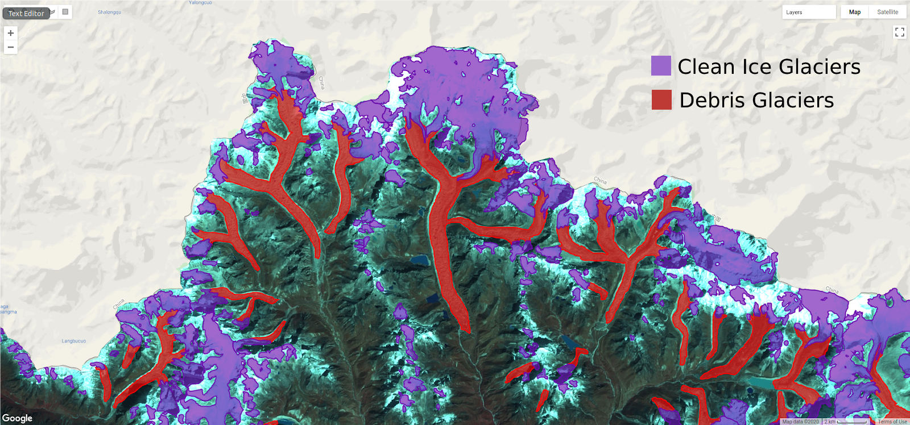
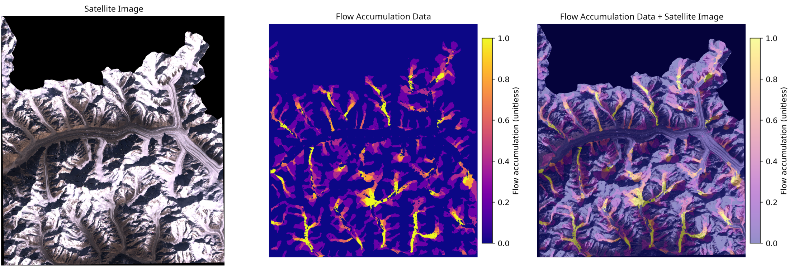
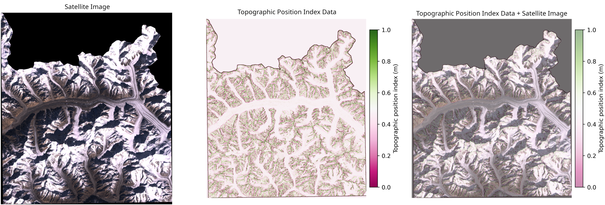
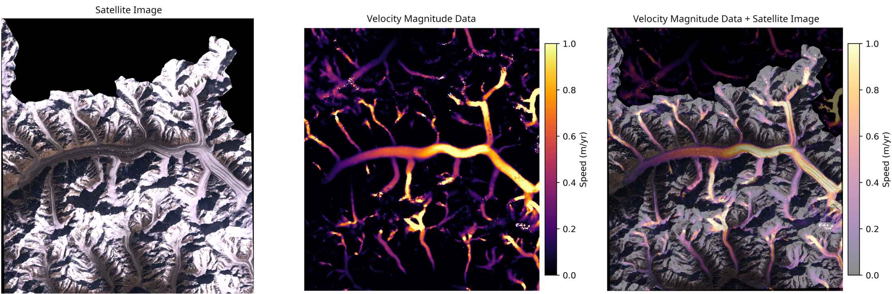
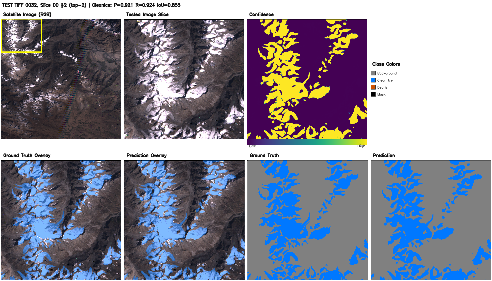
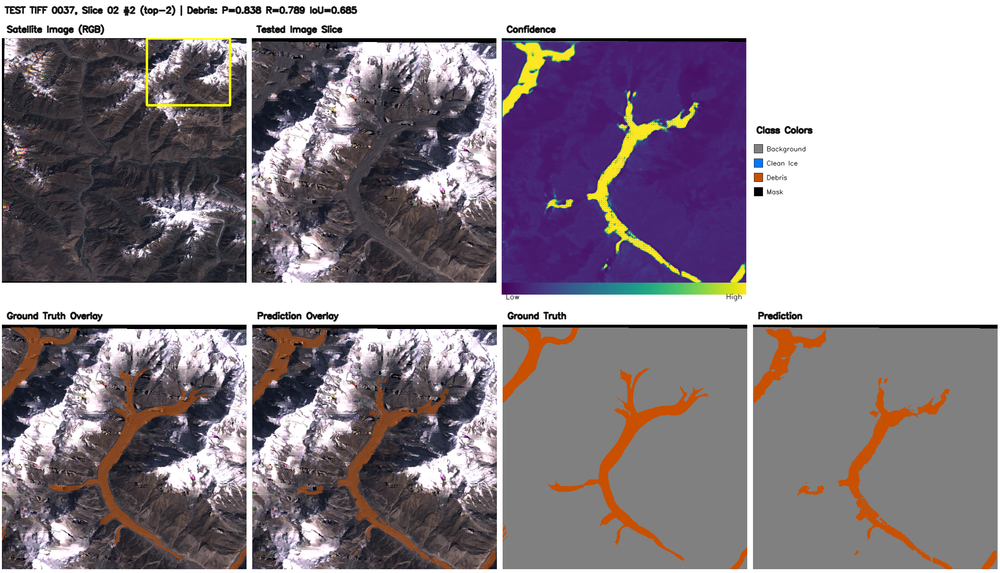

# Physics-Guided Glacier Mapping

This repository contains code for physics-guided clean ice (CI) and
debris-covered ice (DCI) segmentation from Landsat imagery.

The project adds physics-derived information to a standard U-Net pipeline. The
main experiments keep the segmentation architecture fixed and compare how static
terrain channels, dynamic velocity channels, and a velocity-aware loss affect
glacier mapping performance.

## Strategies

1. **Physics-Informed Data Augmentation** -- Encode DEM-derived
   terrain features (flow accumulation, TPI, roughness, plan curvature) and
   spectral indices (NDVI, NDWI, NDSI) as additional input channels to guide
   the model toward physically plausible ice boundaries.

2. **Physics-Informed Loss Functions** -- Penalize predictions that
   violate glacier flow physics using a sigmoid-based velocity loss: if the
   model predicts background on a pixel moving faster than surrounding static
   terrain, it is penalized.

3. **Dynamic Velocity Integration** -- Fuse ITS_LIVE velocity datacubes
   with Landsat imagery using geometric discovery, 7-year temporal aggregation,
   cross-UTM-zone reprojection, and bilinear resampling from 120 m to 30 m.

## Key Results on the HKH Glacier Dataset

| Model | DCI IoU | DCI Prec. | DCI Rec. | CI IoU | CI Prec. | CI Rec. |
|---|---|---|---|---|---|---|
| Standard U-Net | 28.50 | -- | -- | 65.60 | -- | -- |
| Boundary-Aware (SOTA, Aryal et al. 2023) | 35.94 | 51.97 | 53.81 | **68.17** | 81.59 | 80.55 |
| Ours (Flow Only) | 38.50 | 58.90 | 52.60 | 63.50 | 78.90 | 76.40 |
| Ours (Full Static Physics) | **45.92** | **71.89** | **55.96** | **71.22** | **85.39** | **81.10** |
| Ours (Velocity Channels Only) | 32.40 | 70.25 | 37.56 | 70.78 | 82.27 | 83.52 |
| Ours (Velocity Channels + Loss) | 41.91 | 66.40 | 53.20 | 61.83 | 64.90 | **92.90** |
| Ours (Complete Physics-Informed) | **46.07** | **71.95** | **56.16** | 65.85 | 72.36 | 87.98 |

- **Full Static Physics** (DEM flow accumulation + TPI + roughness + plan
  curvature) improves DCI IoU by **+9.98pp (27.8% relative)** over the
  boundary-aware SOTA baseline.
- **Complete Physics-Informed** (static augmentation + velocity channels +
  velocity loss) reaches **46.07% DCI IoU**, a **+10.13pp (28.2% relative)**
  improvement over the boundary-aware SOTA baseline.

## Visual Results

The task is pixel-wise glacier segmentation over HKH Landsat scenes. Clean ice
and debris-covered ice have different visual signatures, so the pipeline uses
spectral, topographic, and dynamic cues rather than RGB imagery alone.

<figure>
  
  <figcaption>HKH glacier labels over satellite imagery: clean ice is shown in purple, and debris-covered ice is shown in red.</figcaption>
</figure>

Static terrain channels are derived from DEMs and aligned with the satellite
image. The triptychs below show the RGB tile, the derived physics channel, and
the channel overlaid on the satellite image.

<figure>
  
  <figcaption>Flow accumulation highlights terrain pathways where ice and water are likely to move downslope.</figcaption>
</figure>

<figure>
  
  <figcaption>Topographic Position Index captures local ridge and valley structure around glacier terrain.</figcaption>
</figure>

Dynamic velocity channels are fused from ITS_LIVE products and resampled to the
Landsat grid. These channels provide a direct physical cue for moving glacier
ice, especially where debris-covered ice is spectrally similar to surrounding
rock.

<figure>
  
  <figcaption>Velocity magnitude separates moving glacier flow from static terrain and supports the velocity-aware loss.</figcaption>
</figure>

Prediction panels compare the input context, confidence map, ground truth, and
model output. Clean ice and debris-covered ice examples are shown separately so
the wide panels remain readable.

<figure>
  
  <figcaption>Clean ice example with high overlap between ground truth and prediction.</figcaption>
</figure>

<figure>
  
  <figcaption>Debris-covered ice example showing the model tracing debris-covered glacier structure through visually ambiguous terrain.</figcaption>
</figure>

## Workflow Overview

The repository is organized around reproducible experiment runs:

1. Define machine-specific paths in `configs/servers.yaml`.
2. Preprocess raw HKH imagery, labels, DEMs, and optional velocity rasters into a
   named processed dataset.
3. Create a small experiment YAML under `configs/{server}/{task}/` that
   overrides only the fields that differ from the global and task defaults.
4. Train with `scripts/train.py`; each run writes checkpoints, TensorBoard logs,
   a frozen `conf.json`, optional validation/test visualizations, and live
   MLflow metrics when MLflow is enabled.
5. Evaluate selected checkpoints with `scripts/predict.py`.
6. Use `scripts/upload_to_mlflow.py` only when a completed local run needs
   post-hoc MLflow artifact upload, regeneration, or repair.

## Installation

Use `uv` from the repository root:

```bash
uv pip install -e .
uv pip install -e ".[dev]"
```

Run a fast sanity check after installation:

```bash
uv run python scripts/test.py --unit
```

## Server Setup

All scripts are server-aware. A server entry tells the pipeline where code,
raw data, processed data, and run outputs live on that machine.

Add or edit an entry in `configs/servers.yaml`:

```yaml
my_server:
  hostname: my-hostname
  ssh_host: user@my-hostname
  code_path: /path/to/glacier-mapping
  output_path: /path/to/glacier-mapping/output
  image_dir: /path/to/HKH_raw/Landsat7_2005
  dem_dir: /path/to/HKH_raw/DEM
  velocity_dir: /path/to/HKH_raw/Velocity
  labels_dir: /path/to/HKH_raw/labels_fixed
  processed_data_path: /path/to/processed/HKH
  num_workers: 8
  batch_size: 8
```

`processed_data_path` is a root directory. Training resolves the actual dataset
as:

```text
{processed_data_path}/{training_opts.dataset_name}/
```

For example, with `processed_data_path: /data/HKH` and
`dataset_name: gen_robust_comprehensive_dci`, training loads:

```text
/data/HKH/gen_robust_comprehensive_dci/
```

Keep server-specific absolute paths in `configs/servers.yaml`; keep experiment
intent in experiment YAML files.

## Preprocessing Datasets

Preprocessing slices raw Landsat images, labels, DEM channels, spectral indices,
HSV channels, and optional ITS_LIVE velocity products into train/val/test
directories. Dataset recipes live in `configs/datasets/`.

Run one dataset recipe:

```bash
uv run python scripts/preprocess.py --server desktop --config configs/datasets/gen_robust_comprehensive_dci.yaml
```

Run every dataset recipe for a server:

```bash
uv run bash run_all_preprocess.sh desktop
```

The dataset config controls the processed dataset name and slicing choices:

```yaml
output_name: "gen_robust_comprehensive_dci"
window_size: [512, 512]
overlap: 64
filter: 0.1
test: 0.2
val: 0.1
add_velocity: true
add_ndvi: true
add_ndwi: true
add_ndsi: true
add_hsv: true
physics_res: 8
physics_scale: 1.0
```

The output dataset contains:

```text
train/                      training slices
val/                        validation slices
test/                       test slices, generated with zero overlap
normalize_train.npy         normalization statistics used by training
slice_meta.csv              saved slice metadata and class balance
skipped_slices_meta.csv     skipped slice metadata
band_metadata.json          channel names used for semantic channel selection
```

## Configuration

Training configuration is merged from four levels:

1. `configs/train.yaml` for global defaults
2. `configs/servers.yaml` for machine-specific paths and hardware settings
3. `configs/tasks/{task}.yaml` for clean ice, debris-covered ice, or
   multiclass task defaults
4. `configs/{server}/{task}/*.yaml` for individual experiment overrides

Keep experiment files minimal: override only the fields that differ from the
upstream defaults.

### Task Defaults

The folder under `configs/{server}/` selects the task defaults:

| Folder | Task | Classes |
|---|---|---|
| `clean_ice/` | Binary clean ice | `output_classes: [1]` |
| `debris_ice/` | Binary debris-covered ice | `output_classes: [2]` |
| `multiclass/` | BG + clean ice + debris | `output_classes: [0, 1, 2]` |

### Experiment Files

Create experiments under the server and task that will run them:

```text
configs/desktop/debris_ice/my_experiment_gpu0.yaml
configs/my_server/clean_ice/my_experiment_gpu1.yaml
```

A typical experiment only needs to name the processed dataset, run, seed, and
overrides:

```yaml
training_opts:
  dataset_name: "gen_robust_comprehensive_dci"
  run_name: "dci_static_physics_seed42"
  mlflow_experiment_name: "physics_ablation"
  mlflow_artifacts_enabled: false
  seed: 42
  run_test_eval: true
  test_eval_n: 4

loader_opts:
  batch_size: 8
  landsat_channels: true
  dem_channels: true
  spectral_indices_channels: true
  hsv_channels: true
  physics_channels: true
  velocity_channels: false

loss_opts:
  use_velocity_loss: false
```

Channel groups are resolved by name from `band_metadata.json`, so experiment
configs do not need hard-coded global channel indices. Each channel group can be
`true`, `false`, or a list of group-local indices or channel names:

```yaml
loader_opts:
  landsat_channels: ["B1", "B2", "B3", "B4", "B5", "B7"]
  spectral_indices_channels: ["NDVI", "NDSI"]
  velocity_channels: ["velocity", "vx"]
```

When any velocity channel is selected, `velocity_mask` is auto-included if it is
available in the processed dataset.

## Training

Train a single experiment:

```bash
uv run python scripts/train.py \
  --config configs/desktop/debris_ice/sota_dci_06_bs12_seed42_gpu0.yaml \
  --server desktop \
  --gpu 0
```

The config path and `--server` must agree. For example, a config under
`configs/desktop/...` must be run with `--server desktop`. This prevents
accidentally training with one machine's paths and another machine's config.

Training writes a timestamped run directory under the server `output_path`:

```text
output/{run_name}_{server}_{timestamp}/
  checkpoints/              top validation checkpoints and last.ckpt
  logs/                     TensorBoard event files
  conf.json                 fully merged config used for the run
  training.log              file log for the run
  val_visualizations/       optional validation panels
  test_evaluations/         optional full test evaluation panels and metrics
```

Useful training flags:

```bash
# Disable MLflow logging for local debugging
uv run python scripts/train.py --config <config> --server desktop --gpu 0 --mlflow-enabled false

# Keep MLflow metrics on, but force artifact uploads off
uv run python scripts/train.py --config <config> --server desktop --gpu 0 --mlflow-artifacts-enabled false

# Override epochs without editing YAML
uv run python scripts/train.py --config <config> --server desktop --gpu 0 --max-epochs 5

# Resume an interrupted run
uv run python scripts/train.py --config <config> --server desktop --gpu 0 --resume output/<run>/checkpoints/last.ckpt

# Write outputs somewhere other than the server output_path
uv run python scripts/train.py --config <config> --server desktop --gpu 0 --output-dir /tmp/glacier_runs
```

## Sequential and Multi-Machine Runs

`run_sequential_training.sh` runs experiment YAMLs for one server in a controlled
order. It discovers configs under:

```text
configs/{server}/{task}/*.yaml
```

Preview the execution plan:

```bash
uv run bash run_sequential_training.sh desktop --dry-run
```

Run all configs for one server:

```bash
uv run bash run_sequential_training.sh desktop --gpu 0
```

Filter by task, base experiments, or GPU suffix:

```bash
# Run only debris-covered ice configs
uv run bash run_sequential_training.sh desktop --tasks dci --gpu 0

# Run only configs whose filename includes gpu1
uv run bash run_sequential_training.sh desktop --gpu 1 --gpu-filter gpu1

# Skip baseline/base configs
uv run bash run_sequential_training.sh desktop --exclude-base

# Prioritize physics+velocity configs inside each task
uv run bash run_sequential_training.sh desktop --physics-velocity-priority
```

For multi-machine training, create one server entry and one config subtree per
machine, then launch the sequential script on each machine with that server
name:

```text
configs/
  desktop/debris_ice/*_gpu0.yaml
  server_a/debris_ice/*_gpu0.yaml
  server_b/clean_ice/*_gpu1.yaml
```

Each machine writes to its own `output_path` and can log to the same MLflow
tracking URI. Use distinct `training_opts.run_name` values or filename suffixes
such as `gpu0`, `gpu1`, and seed IDs so run directories are easy to identify.

## Evaluation and Prediction

Use `scripts/predict.py` after training to evaluate one or two trained models on
a split. The script searches the server `output_path` for matching run
directories and picks the checkpoint with the lowest validation loss.

Evaluate a single DCI model:

```bash
uv run python scripts/predict.py \
  --deb-run-name sota_dci_06_bs12_seed42 \
  --server desktop \
  --gpu 0 \
  --split test
```

Evaluate paired CI and DCI models together:

```bash
uv run python scripts/predict.py \
  --ci-run-name <clean_ice_run_name> \
  --deb-run-name <debris_ice_run_name> \
  --server desktop \
  --gpu 0 \
  --split test
```

Prediction outputs default to `output_predictions/` next to the server
`output_path`, unless `--output-dir` is provided.

## MLflow Tracking

Training uses MLflow directly by default for metrics. `scripts/train.py` creates
an `MLFlowLogger` when `--mlflow-enabled true` and logs scalar metrics from
Lightning during training.

Artifact upload is controlled separately by
`training_opts.mlflow_artifacts_enabled` or the `--mlflow-artifacts-enabled`
CLI override. The default in `configs/train.yaml` is `false`, so current runs
log MLflow metrics but skip artifacts during training. Set it to `true` only
when the MLflow artifact store is writable from the training machine.

Live training writes the complete local run directory regardless of MLflow:

```text
output/{run_name}_{server}_{timestamp}/
  conf.json
  training.log
  checkpoints/
  logs/
  val_visualizations/
  test_evaluations/
```

`scripts/upload_to_mlflow.py` is a post-hoc utility for cases where you want to
separate training from heavier MLflow artifact handling, or where a run needs to
be repaired after training. Use it to:

- upload checkpoints and the frozen `conf.json` from a local run directory
- parse TensorBoard event files and backfill metrics
- upload visualization and test-evaluation artifact directories
- regenerate validation/test panels from saved checkpoints
- update one existing MLflow run when artifacts were missing, stale, or generated
  at too low a resolution

Upload one completed run:

```bash
uv run python scripts/upload_to_mlflow.py output/<run_name> --server desktop
```

Upload all completed runs in an output directory:

```bash
uv run python scripts/upload_to_mlflow.py --batch --output-dir output --server desktop
```

Regenerate high-resolution validation and test artifacts for existing runs:

```bash
uv run python scripts/upload_to_mlflow.py output/<run_name> \
  --server desktop \
  --regenerate \
  --high-res \
  --val-viz-n 8 \
  --test-eval-n 8
```

MLflow experiment names come from `training_opts.mlflow_experiment_name` when it
is set. Otherwise, they are inferred from the task and optional
`training_opts.experiment_prefix`.

Disable live MLflow logging for local debugging or offline training:

```bash
uv run python scripts/train.py --config <config> --server desktop --gpu 0 --mlflow-enabled false
```

Keep MLflow metrics enabled but disable live artifact upload:

```bash
uv run python scripts/train.py --config <config> --server desktop --gpu 0 --mlflow-artifacts-enabled false
```

You can still upload that local run later with `scripts/upload_to_mlflow.py` if
the run directory contains `conf.json`, TensorBoard logs, and checkpoints.

## Development Checks

```bash
uv run python scripts/test.py --unit
uv run python scripts/test.py --server desktop --subset-size 5 --epochs 2
uv run ruff check .
uv run ruff format .
```

## Project Structure

```
configs/                 4-level config merge (global → server → task → experiment)
docs/figures/            README figures
glacier_mapping/
  data/                  Dataset, slicing, physics channel computation
  lightning/             LightningModule, DataModule, callbacks
  model/                 U-Net, losses, evaluation pipeline
  utils/                 Config, MLflow, GPU, visualization
scripts/
  train.py               Training entry point
  predict.py             Test evaluation for paired CI/DCI models
  preprocess.py          Data preprocessing
  upload_to_mlflow.py    Post-training metrics and visualization upload
  test.py                Unit and integration tests
  app_gradio.py          Interactive demo
  create_velocity_from_itslive_mosaic.py  Velocity fusion pipeline
output/                  Run outputs (checkpoints, logs, metrics)
```

## Acknowledgements

This repository originated as a fork of Bibek Aryal's
[`Aryal007/glacier_mapping`](https://github.com/Aryal007/glacier_mapping)
codebase for Boundary Aware U-Net glacier segmentation. The current project has
since diverged substantially through refactoring, new configuration and training
workflows, static terrain physics channels, ITS_LIVE velocity integration, and
physics-informed loss experiments.

The original Boundary Aware U-Net work is:

```bibtex
@article{aryal2023boundary,
  title={Boundary Aware {U}-{N}et for Glacier Segmentation},
  author={Aryal, Bibek and Miles, Katie E. and Zesati, Sergio A. Vargas and Fuentes, Olac},
  journal={Proceedings of the Northern Lights Deep Learning Workshop},
  volume={4},
  year={2023},
  doi={10.7557/18.6789}
}
```

## Citation

```bibtex
@phdthesis{perez2025physics,
  title={Physics-Guided Strategies for Enhancing Neural Networks Trained with Limited Data},
  author={Perez Zamora, Jose Guadalupe},
  school={The University of Texas at El Paso},
  year={2025},
  month={December},
  type={{Ph.D.} dissertation}
}
```
